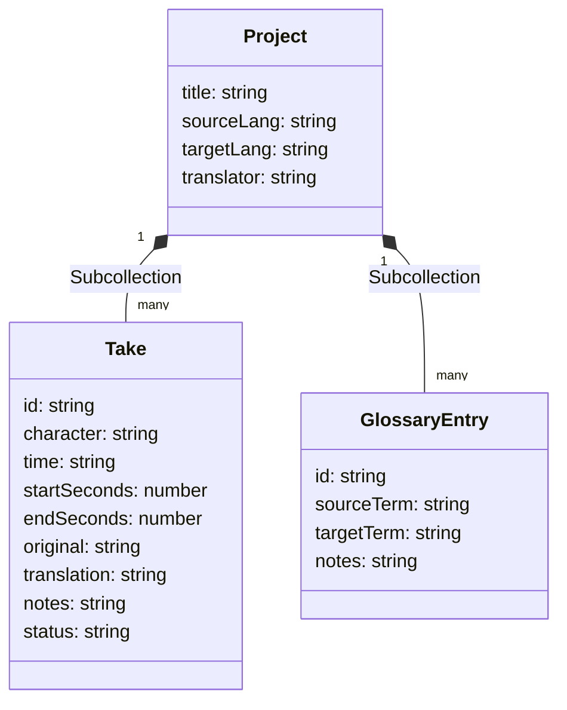

# ARCHITECTURE & SYSTEM REPORT: Dubbing Studio Pro (DubiOvi)

This report details the operational workflows, data schemas, AI integrations, deployment configurations, and feature status of the **Dubbing Studio Pro** application, concluding with the definition of a Minimum Viable Product (MVP).

---

## 1. Complete User Workflow

The application coordinates four panels: a local video player, a settings/script editor, a terminology glossary, and a bottom timeline.

```text
[   Header: DUBIOVI Title | Save Status | Cloud Save Button | Profile   ]
=========================================================================
[ Local Video Player (Left) ]  |  [ Tabbed Editor Panel (Right)         ]
                               |  - Takes (Side-by-side table)
                               |  - Import/Export (.docx/.txt/JSON)
                               |  - Settings (Metadata, Languages)
                               |  - Glossary (Terminology rules)
=========================================================================
[ Bottom Panel: Timebar & Color-Coded Takes Timeline                    ]
```

### 1.1. Start-to-Finish User Walkthrough
1. **Workspace Entry**: The user opens the dashboard. The client initialises a subscription to the Firebase Firestore `projects/main-project` document, loading configuration and existing script takes.
2. **Loading Media**: The user clicks **Upload Video** inside the left panel. They select a local video file (e.g., `.mp4`, `.webm`). The browser loads it as a local blob URL (`URL.createObjectURL(file)`). The video duration is calculated, setting the timeline's scale.
3. **Setting Context**: Under **Settings**, the user sets the project title, translator name, and language pair (e.g., English to Spanish). Under **Glossary**, they define rules (e.g., translating "Objection" as "Objeción").
4. **Script Ingestion**:
   - The user navigates to **Import/Export -> Import**.
   - They upload a `.txt` or `.docx` file (parsed in-browser via the `mammoth` library) or paste raw script paragraphs.
   - The app splits the script by double linebreaks, assigns speakers, estimates timecodes based on a speed of 2.5 words/second, and batch-saves them to Firestore.
5. **Translation & Subtitling**:
   - In the **Takes** tab, original lines and translations are presented side-by-side.
   - The user clicks the **Sparkles** icon on a take to generate an AI translation suggestion.
   - The server action fetches a translation from Gemini 2.5 Flash using Genkit, applies the glossary rules, and updates the translation in Firestore.
   - The user reviews, alters translations manually, and adds notes. Every edit is saved to Firestore on input loss (`onBlur`).
6. **Timeline Sync**:
   - The user plays the video. The row corresponding to the current video timecode is highlighted.
   - The user clicks colored blocks on the timeline to jump the video playback to that take's start time, or clicks the playbar to scrub the playhead.
7. **Exporting Output**: The user navigates to **Import/Export -> Export**, selects the target format (SRT, VTT, JSON, or TXT), and copies the text to their clipboard.

### 1.2. Currently Implemented Features
- **Local Video playback** tracking and timebar syncing.
- **Client-side `.docx` text extraction** using the `mammoth` parser.
- **Real-time Firestore listeners** for takes and glossary tables.
- **Serverless Genkit translation** utilizing Gemini 2.5 Flash.
- **Glossary enforcement post-processing** using Regex word boundary replacements.
- **Subtitles generation** supporting SRT, VTT, and JSON exports.

### 1.3. Unfinished or Gapped Features
- **Timeline Zoom & Scroll**: Mentioned in the `blueprint.md` specifications but absent. The timeline is fixed horizontally to the panel width.
- **Automated Timecode Adjustment**: Blueprint features like "detected audio shift" or "detected pauses silence insertion" are completely unimplemented.
- **Export Customization**: The blueprint calls for options to include/exclude metadata/timecodes during export, but the formats are currently hardcoded.
- **Save to Cloud button**: Renders in the header but only performs a duplicate write of `settings` to Firestore (which are already updated automatically on change). It does not back up or snapshot takes/glossary.

---

## 2. Firebase Infrastructure & Usage

The project utilizes the Firebase Web Client SDK for data persistence and Next.js server compatibility.



### 2.1. Firestore Schema & Paths

1. **Project Document**:
   - **Path**: `projects/{projectId}` (currently static `projects/main-project`)
   - **Fields**:
     - `title` (string)
     - `sourceLang` (string)
     - `targetLang` (string)
     - `translator` (string)

2. **Takes Subcollection**:
   - **Path**: `projects/{projectId}/takes/{takeId}`
   - **Fields**:
     - `id` (string - UUID v4)
     - `character` (string - e.g., "Speaker 1")
     - `time` (string - formatted text "MM:SS.ms --> MM:SS.ms")
     - `startSeconds` (number)
     - `endSeconds` (number)
     - `original` (string)
     - `translation` (string)
     - `notes` (string)
     - `status` (string: "In Progress" | "Translated" | "Approved")

3. **Glossary Subcollection**:
   - **Path**: `projects/{projectId}/glossary/{glossaryId}`
   - **Fields**:
     - `id` (string - UUID/random token)
     - `sourceTerm` (string)
     - `targetTerm` (string)
     - `notes` (string, optional)

### 2.2. Authentication
- **Current Status**: **Unused**. Auth is initialized in `index.ts` but there are no client login forms, routers, or permission restrictions. All users share the static `main-project` document path.

### 2.3. Real-Time Listeners
Two permanent listeners are configured in `page.tsx` within a React `useEffect`:
- **Takes Listener**: Synchronizes local `takes` state, sorting the array by `startSeconds` in ascending order on any document update, addition, or deletion.
- **Glossary Listener**: Synchronizes local `glossary` state.

### 2.4. Required Firebase Services
- **Cloud Firestore**: Stores project metadata, translations, and glossary rules.
- **Firebase App Hosting**: Next.js App Router Node SSR hosting.

---

## 3. AI Integrations (Genkit & Gemini)

AI functions are isolated as **Genkit Flows** in server actions (`'use server'`), ensuring API keys are kept on the backend.

### 3.1. Flow 1: Translation Suggestions
- **Location**: [src/ai/ai-translation-suggestions.ts](file:///Users/alfonso/Desktop/DubiOvi/src/ai/ai-translation-suggestions.ts)
- **Name**: `getTranslationSuggestionFlow`
- **Input**:
  - `originalText` (string)
  - `sourceLanguage` (string)
  - `targetLanguage` (string)
  - `glossary` (array of `GlossaryEntry` objects)
- **Output**: `{ translation: string }`
- **Core Logic**:
  1. Calls `translationPrompt` (Gemini 2.5 Flash model).
  2. Fallback Regex check: Loops through glossary items and runs a case-insensitive, word-boundary search-and-replace (`new RegExp('\\b' + entry.sourceTerm + '\\b', 'gi')`) on the model's output to guarantee terms are translated correctly.

#### Translation Prompt Template:
```handlebars
You are a translation expert.
Translate the given text from {{sourceLanguage}} to {{targetLanguage}}.

{{#if glossary}}
You MUST use the following glossary to ensure consistency.
Glossary:
{{#each glossary}}
- "{{sourceTerm}}" must be translated as "{{targetTerm}}"
{{/each}}
{{/if}}

Original text: {{{originalText}}}
Translation:
```

---

### 3.2. Flow 2: Take Sentiment Analysis
- **Location**: [src/ai/flows/sentiment-analysis-takes.ts](file:///Users/alfonso/Desktop/DubiOvi/src/ai/flows/sentiment-analysis-takes.ts)
- **Name**: `sentimentAnalysisFlow`
- **Input**: `text` (string)
- **Output**: `{ sentiment: string, score: number }` (where score ranges from -1.0 to 1.0)
- **Core Logic**: Executes `sentimentAnalysisPrompt` with structural JSON constraint feedback.

#### Sentiment Prompt Template:
```handlebars
Analyze the sentiment of the following text and provide a sentiment label and a numerical score.

Text: {{{text}}}

Respond in JSON format with "sentiment" and "score" fields.
```

---

## 4. Deployment & Cost Specifications

### 4.1. Required Configuration Keys
To build and run the application, the following keys must be present in the server environment (or local `.env`):
- `GEMINI_API_KEY`: API key for accessing Google GenAI models.
- `NEXT_PUBLIC_FIREBASE_API_KEY`: Public Firebase credentials.
- `NEXT_PUBLIC_FIREBASE_AUTH_DOMAIN`
- `NEXT_PUBLIC_FIREBASE_PROJECT_ID`
- `NEXT_PUBLIC_FIREBASE_STORAGE_BUCKET`
- `NEXT_PUBLIC_FIREBASE_MESSAGING_SENDER_ID`
- `NEXT_PUBLIC_FIREBASE_APP_ID`

### 4.2. External System Integrations
- **Unsplash API**: Renders the background poster image for the empty Video Player.
- **Google Fonts API**: Renders the custom font `Inter` onto the workspace layout.

### 4.3. Cost Matrix

| Resource | Operation | Cost Mechanism | Cost Impact |
| :--- | :--- | :--- | :--- |
| **Gemini 2.5 Flash** | Input tokens | ~$0.075 / 1M tokens | Extremely Low. Translation tasks are small (<150 tokens average). |
| **Gemini 2.5 Flash** | Output tokens | ~$0.30 / 1M tokens | Extremely Low. |
| **Cloud Firestore** | Document Reads | $0.06 / 100k reads | Medium. Real-time updates trigger read operations for all active users. |
| **Cloud Firestore** | Document Writes | $0.18 / 100k writes | **High**. Currently, typing settings updates Firestore on every single keystroke. |
| **Cloud Firestore** | Document Deletes| $0.02 / 100k deletes | Low. |

---

## 5. Feature Inventory Table

| Feature Name | File Location | Status | Details / Failure Point |
| :--- | :--- | :--- | :--- |
| **Video Playback** | `src/components/VideoPlayer.tsx` | **Working** | Local media upload and playback-time emissions work correctly. |
| **Document Ingestion** | `src/components/ImportExportPanel.tsx` | **Broken** | `mammoth` text parsing runs correctly, but saving the imported takes crashes in `handleTakesChange` due to the invalid `getDoc` query. |
| **JSON Import/Load** | `src/components/ImportExportPanel.tsx` | **Broken** | Crashes on executing `getDoc(collection(...) as any)` in [src/app/page.tsx](file:///Users/alfonso/Desktop/DubiOvi/src/app/page.tsx#L140). |
| **Take Editor Table** | `src/components/TakesList.tsx` | **Working** | Updates save to state and emit `onTakeUpdate` to save to Firestore. |
| **Take Deletion** | `src/components/TakesList.tsx` | **Broken** | Crashes in `handleTakeDelete` due to the missing `deleteDoc` import in [src/app/page.tsx](file:///Users/alfonso/Desktop/DubiOvi/src/app/page.tsx). |
| **Subtitles Export** | `src/components/ImportExportPanel.tsx` | **Working** | Formats script into SRT/VTT/TXT data and copies output to clipboard. |
| **AI Translation Suggestions** | `src/ai/ai-translation-suggestions.ts` | **Working** | Fetches translations from Gemini and overrides terms using glossary rules. |
| **AI Sentiment Analysis** | `src/ai/flows/sentiment-analysis-takes.ts` | **Unused** | Flow and `SentimentDisplay` component are fully implemented but never rendered in the UI. |
| **Project Settings** | `src/components/ProjectSettings.tsx` | **Working** | Saves edits directly to the database. Needs debouncing. |
| **Glossary Terms** | `src/components/GlossaryPanel.tsx` | **Working** | Saves terminology mapping. Uses client-side `crypto.randomUUID()`. |
| **Visual Timeline** | `src/components/Timeline.tsx` | **Working** | Basic playhead tracking and seeking. Lacks zoom/scroll functionality. |

---

## 6. MVP Path: Minimum Viable Version

To transition from the current state to a fully functional Minimum Viable Product (MVP), the following tasks must be resolved:

1. **Resolve Compilation & Runtime Crashes**:
   - Import `deleteDoc` in `src/app/page.tsx` from `'firebase/firestore'`.
   - Remove/refactor the invalid `getDoc(collection(...) as any)` call in `handleTakesChange`.
2. **Debounce Firestore Database Writes**:
   - Wrap the Firestore updates in `handleSettingsChange` and `handleTakeUpdate` (for take inputs) in a debounce function (e.g., 500ms delay) to prevent database throttling and write-cost inflation during user typing.
3. **Initialize Projects with Default Data**:
   - When Firestore returns zero takes for a project, populate it using `DEFAULT_TAKES` (from `src/lib/data.ts`) to provide users with a sample workspace.
4. **Integrate Sentiment Analysis**:
   - Embed the existing [SentimentDisplay](file:///Users/alfonso/Desktop/DubiOvi/src/components/SentimentDisplay.tsx) component inside the `TakesList` grid cells (for example, below the original text block) to make this core feature accessible.
5. **Secure UUID Generation**:
   - Replace client-side `crypto.randomUUID()` in the glossary panel with the imported `v4` from `uuid` to ensure compatibility across older browser engines and unsecured HTTP environments.
