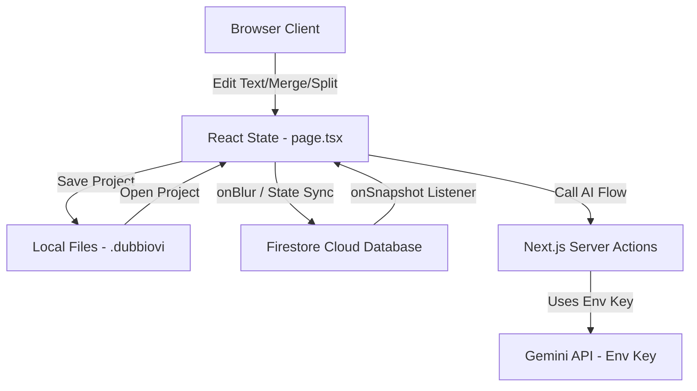
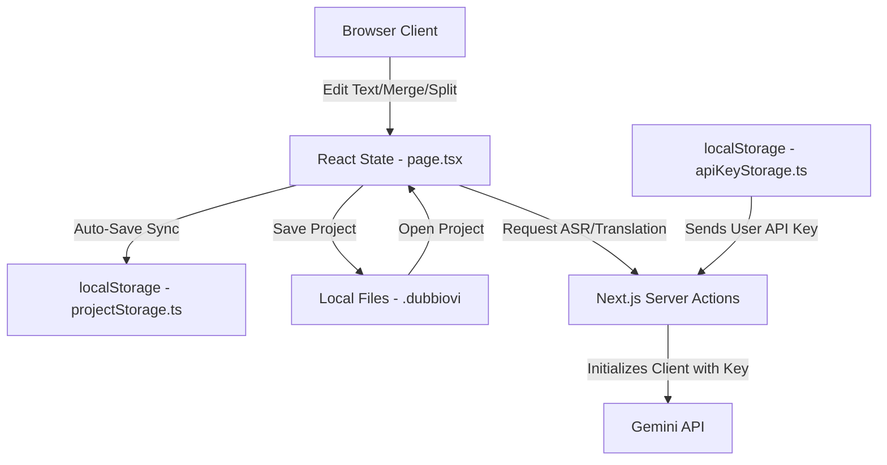

# DubbiOvi Local-First Migration Audit

This audit evaluates the feasibility, risks, and execution strategy for migrating DubbiOvi from a Firebase-synchronized database model to a 100% local-first architecture on the `firebase-removal-local-first` branch.

---

## 1. Current Firebase & AI Codebase Analysis

### A. Firebase Usage
1. **Authentication**: Initialized inside `src/firebase/index.ts` via `getAuth()`. It is **not** imported or used by any UI page or component.
2. **Firestore**: Used for real-time synchronization. Every take edit, settings update, and glossary addition is sent to Firestore and synchronized back via active listeners.
3. **Storage**: Not imported or used.
4. **Providers**: Wrapped in `FirebaseClientProvider` (in `layout.tsx`) and `FirebaseProvider` (in `provider.tsx`), injecting instances into the application context.
5. **Initialization**: Initialized client-side using credentials read from public environment variables `NEXT_PUBLIC_FIREBASE_*`.

### B. Files Importing Firebase Libraries
* `src/firebase/index.ts`
* `src/firebase/provider.tsx`
* `src/firebase/client-provider.tsx`
* `src/firebase/config.ts`
* [page.tsx](file:///Users/alfonso/Desktop/DubiOvi/src/app/page.tsx) (imports `firebase/firestore` API functions and `useFirestore` hook)
* [layout.tsx](file:///Users/alfonso/Desktop/DubiOvi/src/app/layout.tsx) (imports `FirebaseClientProvider`)

### C. Files Depending on Authentication State
* **None**. No routes, dialogs, or actions require authenticated users.

### D. Firestore Collections and Documents Used
* `projects/main-project` (Document): Stores project settings (`projectName`, languages, translator).
* `projects/main-project/takes` (Collection): Stores timed dialogue takes.
* `projects/main-project/glossary` (Collection): Stores terminology glossary entries.

### E. Current Persistence Mechanisms
* **Firestore Sync**: Auto-saves state in real-time. Data is re-loaded on page refresh using the `onSnapshot` active connection.
* **Local Project Files (.dubbiovi)**: Exports full project settings, takes, and glossary structures as JSON files. Opening a project parses the file and restores states.

### F. Environment Variables Required
* `GEMINI_API_KEY`: Server-side API key for Genkit / Gemini models.
* `NEXT_PUBLIC_FIREBASE_*` (6 variables): Public Firebase client keys.

### G. Gemini Dependencies & AI Flows
* **Dependencies**: `genkit` and `@genkit-ai/google-genai` plugins.
* **Server-side AI Flows**:
  * `asrTranscriptionFlow` (in [asr-transcription.ts](file:///Users/alfonso/Desktop/DubiOvi/src/ai/flows/asr-transcription.ts))
  * `sentimentAnalysisFlow` (in [sentiment-analysis-takes.ts](file:///Users/alfonso/Desktop/DubiOvi/src/ai/flows/sentiment-analysis-takes.ts))
  * `getTranslationSuggestionFlow` (in [ai-translation-suggestions.ts](file:///Users/alfonso/Desktop/DubiOvi/src/ai/ai-translation-suggestions.ts))

---

## 2. Architecture Diagrams

### Current Architecture (Firebase-Dependent)

### Proposed Architecture (100% Local-First)

---

## 3. Feasibility Evaluations

### A. Removing Firebase Completely
* **Feasibility: 100%**. Since the application operates on independent workspace states that are already fully exported to local JSON `.dubbiovi` files, Firestore is redundant. Replacing it with client-side `localStorage` auto-saves removes network latency and database configuration overhead.

### B. Removing Logins completely
* **Feasibility: 100%**. There is no login system in use. Removing auth configuration deletes dead code.

### C. Local-First Architecture
* **Feasibility: 100%**. Storing takes, settings, and glossaries in local storage via custom file controllers ensures instant reads/writes, offline operation, and eliminates database connection errors.

### D. User-Supplied Gemini API Key
* **Feasibility: High**. 
  * Currently, server-side flows use the server's `GEMINI_API_KEY`.
  * To support user keys, we can store the user's key in browser local storage (`apiKeyStorage.ts`). When invoking server actions (like `getAudioTranscription` or `getTranslationSuggestion`), we pass the user's API key as an input parameter. The server action then initializes Genkit dynamically using the provided key instead of `process.env.GEMINI_API_KEY`.

### E. Future Desktop Packaging (Electron/Tauri)
* **Feasibility: High**. Removing Firebase and utilizing client-side storage and user-supplied API keys makes the app a static web application. This is ideal for packaging into desktop applications using Tauri or Electron.

---

## 4. Refactoring & Storage Abstraction Strategy

### What can be removed safely:
* All files in `src/firebase/*`.
* `FirebaseClientProvider` wrapper in `src/app/layout.tsx`.
* Firebase credentials in `.env` and `package.json` dependencies.

### What should be abstracted:
1. **`src/lib/projectStorage.ts`** [NEW]
   * Handles saving and restoring the full workspace state (takes, settings, glossary) to `localStorage` under `dubbiovi_autosave`.
2. **`src/lib/settingsStorage.ts`** [NEW]
   * Manages default project metadata and configurations.
3. **`src/lib/apiKeyStorage.ts`** [NEW]
   * Manages client-side storage for the user-supplied Gemini API key.

---

## 5. Migration Phases & Risk Assessment

| Phase | Description | Key Affected Files | Risk Level |
|---|---|---|---|
| **Phase 1: Storage Abstraction** | Create `projectStorage.ts`, `settingsStorage.ts`, and `apiKeyStorage.ts`. Implement local state auto-saving. | `src/lib/*` (New files) | **Low** |
| **Phase 2: Controller Decoupling** | Remove Firestore imports/calls from `page.tsx`. Connect page states to auto-save controllers. | `src/app/page.tsx` | **Medium** |
| **Phase 3: Firebase Removal** | Delete `src/firebase/` directory, package dependencies, and layout providers. | `package.json`, `src/app/layout.tsx` | **Low** |
| **Phase 4: User API Key Integration** | Pass custom keys from local storage through Server Actions to initialize Genkit dynamically. | `src/app/actions.ts`, `src/ai/*` | **Medium** |
