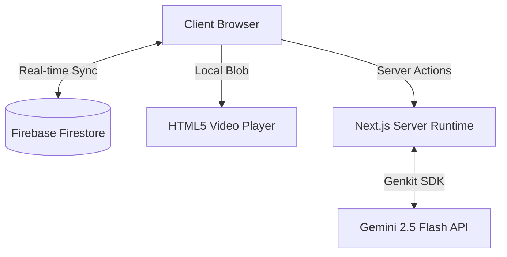

# PROJECT REVIEW: Dubbing Studio Pro (DubiOvi)

An in-depth analysis of the architecture, design, components, bugs, and technical health of the **Dubbing Studio Pro** application.

---

## 1. Executive Summary

**Dubbing Studio Pro** (codename `DubiOvi`) is a web-based dubbing translator assistant. It aims to streamline the process of translating and synchronizing video scripts into target languages. By integrating generative AI, it offers features like translation suggestions aligned with a project glossary and sentiment analysis of script lines to ensure tone consistency. 

Key user capabilities include:
- **Local Media Loading**: Playing video files in-browser locally using blobs.
- **Script Parsing**: Extracting raw script blocks from text inputs or imported `.txt`/`.docx` documents.
- **Side-by-Side Editing**: Translating script takes within an interactive grid.
- **AI Integration**: Requesting contextual translation suggestions and analyzing sentiment.
- **Timecode-linked Timeline**: visual representation of script takes against video length.
- **Data Exporting**: Formatting completed scripts into industry-standard SRT, VTT, and plain text formats.
- **Cloud Synchronization**: Using Firebase Firestore to keep workspace data saved and synchronized.

---

## 2. Technology Stack & Architecture

The application is structured as a modern, single-page server-assisted dashboard built on a unified Next.js/Firebase foundation.



### Core Technologies
- **Frontend Framework**: [Next.js (v15.3.8)](https://nextjs.org/) utilizing React (v18.3.1) and the App Router directory structure.
- **AI Framework**: [Firebase Genkit (v1.20.0)](https://firebase.google.com/docs/genkit) with the Google GenAI plugin (`@genkit-ai/google-genai`), targeting the `googleai/gemini-2.5-flash` model.
- **Database**: [Firebase Web SDK (v11.9.1)](https://firebase.google.com/docs/firestore) for client-side firestore listeners (`onSnapshot`).
- **Styling**: [Tailwind CSS (v3.4.1)](https://tailwindcss.com/) combined with [Shadcn UI](https://ui.shadcn.com/) components and [Radix UI](https://www.radix-ui.com/) primitives.
- **Deployment & Hosting**: [Firebase App Hosting](https://firebase.google.com/docs/app-hosting) (configured in `apphosting.yaml`).

---

## 3. Directory Layout & Codebase Structure

The project directory contains the following layout:
```text
DubiOvi/
├── .agents/                 # AI Agent workflows and documentation
├── .idx/                    # Project IDX configuration
├── docs/
│   └── blueprint.md         # Original blueprint and design specifications
├── src/
│   ├── ai/                  # Genkit configuration, prompts, and flows
│   │   ├── flows/           # Genkit flows (e.g., sentiment analysis)
│   │   ├── dev.ts           # Genkit developer execution setup
│   │   └── genkit.ts        # Genkit initialization settings
│   ├── app/                 # Next.js App Router root & Server Actions
│   │   ├── actions.ts       # Server Actions for client components
│   │   ├── globals.css      # Core Tailwind CSS configuration and classes
│   │   ├── layout.tsx       # Root layout, providers, and toaster
│   │   └── page.tsx         # Main application coordinator page
│   ├── components/          # React Components (both layouts and UI primitives)
│   │   ├── ui/              # Shadcn/Radix atomic UI components
│   │   └── ...              # Domain-specific components
│   ├── firebase/            # Firebase SDK setup and provider contexts
│   ├── hooks/               # Custom react hooks (mobile check, toasts)
│   └── lib/                 # Shared types, mock data, and utility files
```

---

## 4. Component Analysis & Functionality

| Component | Path | Description & Core Logic |
| :--- | :--- | :--- |
| **Main Page** | [page.tsx](file:///Users/alfonso/Desktop/DubiOvi/src/app/page.tsx) | Renders the global layout via a resizable vertical split-panel. Coordinates state between Firestore, the video player, script tables, settings, and the bottom timeline. |
| **Video Player** | [VideoPlayer.tsx](file:///Users/alfonso/Desktop/DubiOvi/src/components/VideoPlayer.tsx) | Handles local file uploads, loads them as object URLs (`URL.createObjectURL(file)`), tracks playback position, and fires `onTimeUpdate`. |
| **Takes List** | [TakesList.tsx](file:///Users/alfonso/Desktop/DubiOvi/src/components/TakesList.tsx) | Displays a table of takes. Highlights the active take relative to video time, provides text fields for editing, and initiates AI translation requests. |
| **Timeline** | [Timeline.tsx](file:///Users/alfonso/Desktop/DubiOvi/src/components/Timeline.tsx) | Draws takes as colored bars proportional to their duration. Handles playhead positioning and allows scrubbing to seek in the video. |
| **Glossary Panel** | [GlossaryPanel.tsx](file:///Users/alfonso/Desktop/DubiOvi/src/components/GlossaryPanel.tsx) | Manages inline terms and target translation mappings. Used to enforce terminology consistency in LLM translations. |
| **Import/Export Panel** | [ImportExportPanel.tsx](file:///Users/alfonso/Desktop/DubiOvi/src/components/ImportExportPanel.tsx) | Parses pasted script texts or uploaded `.txt`/`.docx` documents (using client-side `mammoth`) into takes, estimating timing. Exports takes to SRT, VTT, JSON, and Text formats. |
| **Project Settings** | [ProjectSettings.tsx](file:///Users/alfonso/Desktop/DubiOvi/src/components/ProjectSettings.tsx) | Form to manage title, source/target languages, and translator metadata. |
| **Sentiment Display** | [SentimentDisplay.tsx](file:///Users/alfonso/Desktop/DubiOvi/src/components/SentimentDisplay.tsx) | Debounces text inputs and calls server-side sentiment analysis to display results. *(Note: Unused in the UI)* |

---

## 5. Potential Bugs & Technical Debt

### 5.1. Critical Runtime Bugs 🔴

#### Bug 1: Missing Import of `deleteDoc`
In [src/app/page.tsx](file:///Users/alfonso/Desktop/DubiOvi/src/app/page.tsx#L206-L210), the take deletion handler calls `deleteDoc`:
```typescript
  const handleTakeDelete = async (id: string) => {
    if (!db) return;
    const takeRef = doc(db, 'projects', projectId, 'takes', id);
    await deleteDoc(takeRef);
  };
```
**Problem**: `deleteDoc` is **not** imported at the top of the file. This will trigger a `ReferenceError: deleteDoc is not defined` runtime crash the moment a user attempts to delete a take.

---

#### Bug 2: Invalid Firestore Query (`getDoc` on Collection)
In [src/app/page.tsx](file:///Users/alfonso/Desktop/DubiOvi/src/app/page.tsx#L140):
```typescript
    // Efficiently sync takes
    const existingTakesSnapshot = await getDoc(collection(db, 'projects', projectId, 'takes') as any);
```
**Problem**: `getDoc` accepts a `DocumentReference`. Passing it a `CollectionReference` will cause Firestore to throw a runtime error. This crashes the import execution in `handleTakesChange`. Furthermore, `existingTakesSnapshot` is completely unused.

---

### 5.2. Code Smells & Gaps ⚠️

#### Smell 1: Dead Code (Unused Components & Data)
- **`SentimentDisplay` Component**: Renders the sentiment indicators but is never imported or displayed in `page.tsx` or `TakesList.tsx`.
- **`DEFAULT_TAKES`**: Defined in `data.ts` but never used to initialize empty projects, leaving first-time users with a blank slate.
- **Unused Variables**: `existingIds` in `page.tsx` (L141) is initialized but never used.

#### Smell 2: Inefficient Save Operations (No Input Debounce)
In [src/app/page.tsx](file:///Users/alfonso/Desktop/DubiOvi/src/app/page.tsx#L122-L128), `handleSettingsChange` updates the cloud Firestore document on **every single keystroke**:
```typescript
  const handleSettingsChange = (newSettings: ProjectSettings) => {
    setSettings(newSettings);
    // Persist immediately
    if (db) {
      setDoc(doc(db, 'projects', projectId), newSettings);
    }
  };
```
This causes heavy Firestore write traffic, creates race conditions due to asynchronous latency, and increases API call costs.

#### Smell 3: Hardcoded Video Playback References
`TakesList.tsx` has a `videoRef` prop passed down, but it is not utilized inside the list for synchronization (only index tracking is handled by the main page).

#### Smell 4: Client-side `crypto.randomUUID()` Compatibility
`GlossaryPanel.tsx` uses `crypto.randomUUID()`. In older browser engines or unsecured HTTP hosting, `crypto.randomUUID` is undefined. The project already lists `uuid` in `package.json`, which is a safer import.

---

## 6. File Categorization

### 6.1. Critical Files (Application cannot run without these)
- `/package.json`: Dependency manifests and Next.js/Genkit build scripts.
- `/.env`: Contains the `GEMINI_API_KEY` necessary to run server actions.
- `/src/firebase/config.ts` & `/src/firebase/index.ts`: Configures the database connections.
- `/src/ai/genkit.ts` & `/src/ai/ai-translation-suggestions.ts`: Holds Genkit initialization and Server Actions.
- `/src/app/layout.tsx` & `/src/app/page.tsx`: Core layout structure and dashboard logic.
- `/src/components/VideoPlayer.tsx`, `/src/components/TakesList.tsx`, `/src/components/Timeline.tsx`: Main user interaction components.
- `/src/lib/utils.ts` & `/src/lib/types.ts`: Holds parsing and subtitles converters (SRT/VTT).

### 6.2. Unused Files (Recommended to remove or archive)
The following 18 Shadcn UI components are defined but never imported anywhere in the source code. They can be removed along with their `@radix-ui/` packages in `package.json` to reduce package size:
1. `src/components/ui/accordion.tsx`
2. `src/components/ui/alert-dialog.tsx`
3. `src/components/ui/alert.tsx`
4. `src/components/ui/avatar.tsx`
5. `src/components/ui/calendar.tsx`
6. `src/components/ui/carousel.tsx`
7. `src/components/ui/chart.tsx`
8. `src/components/ui/checkbox.tsx`
9. `src/components/ui/collapsible.tsx`
10. `src/components/ui/dialog.tsx`
11. `src/components/ui/form.tsx`
12. `src/components/ui/menubar.tsx`
13. `src/components/ui/radio-group.tsx`
14. `src/components/ui/separator.tsx`
15. `src/components/ui/sheet.tsx`
16. `src/components/ui/sidebar.tsx`
17. `src/components/ui/slider.tsx`
18. `src/components/ui/switch.tsx`
19. `src/hooks/use-mobile.tsx`: Only imported by the unused `sidebar.tsx` component.

---

## 7. Product Quality Assessment

### 7.1. UI/UX
- **Pros**: The split pane layout using `react-resizable-panels` makes it easy to adjust workspace splits on a desktop monitor. The interface has a clean dark look.
- **Cons**: Launching the project displays a completely empty table, giving no onboarding guidance to the user. The timeline consists of basic flat colored blocks with no zoom capability, making it hard to align takes in longer videos.

### 7.2. Responsiveness
- **Evaluation**: **Low**. The workspace layout utilizes fixed heights (`h-screen overflow-hidden`) tailored for wide monitor viewports. On mobile screens, the panels squish, causing the video controls, lists, and timeline to overlap and become unusable. It does not adapt to a single-column stacked view on mobile.

### 7.3. Accessibility
- **Evaluation**: **Medium-Low**. 
  - Uses Radix components which ensure proper keyboard access for tabs and popups.
  - However, text inputs and textareas in the Takes table lack descriptive `aria-label` tags.
  - The text font size in inputs is extremely small (`text-xs`), reducing legibility.
  - Timeline tracks rely purely on visual color index shifts without alternative descriptors.

### 7.4. Performance
- **Evaluation**: **Medium**. Local video parsing avoids high video-upload latencies. However, the lack of input debouncing for settings and takes makes database synchronization chatty, which may bottleneck user interaction under slow network conditions.

### 7.5. Maintainability
- **Evaluation**: **High**. The project is built using TypeScript, which prevents interface errors. Code paths are clean: components handle layout, Genkit handles LLM prompts, and actions manage database mapping.

### 7.6. Security
- **Evaluation**: **Medium**. AI keys (`GEMINI_API_KEY`) are kept on the server, which is secure. However, there are no references to Firebase Security Rules, meaning Firestore access defaults to public read/write permissions on the collections if not guarded on the console.

---

## 8. Deployment Evaluation

### Can this project be deployed directly to GitHub Pages?
**No, it cannot.**

### Key Reasons:
1. **Next.js Server Actions**: The application utilizes Next.js Server Actions (marked `'use server'`) to interact with Genkit for translation suggestions (`getTranslationSuggestion`) and sentiment analysis (`analyzeSentiment`). Server Actions require an active Node.js server runtime to process the request on the backend. They cannot run on a static file host like GitHub Pages.
2. **API Key Security**: The app connects to the Gemini API using `GEMINI_API_KEY`. If compiled to a static client-only site, these keys would have to be loaded inside the browser, exposing them to theft and misuse.
3. **Firestore Integration**: While Firebase Firestore can be updated directly from client SDKs, the server-side environment is required to coordinate routing and Next.js page generation.

### Recommended Deployment Paths:
- **Firebase App Hosting**: (Already configured via `apphosting.yaml`). This is the ideal target since it supports SSR, Next.js features, Server Actions, and handles secure environment variables automatically.
- **Vercel** or **Netlify**: Both fully support Next.js dynamic routing, serverless actions, and server-side environment variables.
