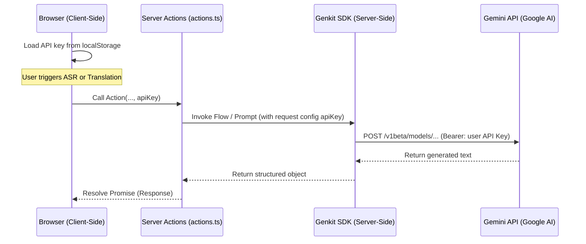

# User Gemini API Key Implementation Plan (Phase 2)

This document outlines the proposed design, architecture, risks, and implementation strategy for enabling users to configure and utilize their own Gemini API keys locally in DubbiOvi.

---

## 1. Architecture Analysis

Currently, DubbiOvi delegates ASR transcription, translation suggestions, and sentiment analysis to server-side Next.js Server Actions:
- `getAudioTranscription` calls `asrTranscriptionFlow`.
- `getSentiment` calls `analyzeSentiment`.
- `getTranslationSuggestion` calls `getTranslationSuggestionFlow`.

All these flows initialize and utilize a singleton Genkit instance defined in [genkit.ts](file:///Users/alfonso/Desktop/DubiOvi/src/ai/genkit.ts), which implicitly loads the server's `GEMINI_API_KEY` from the environment (`process.env.GEMINI_API_KEY`).

### Client-to-Server API Key Transmission
Since the user's API key is input in the settings and stored locally in the browser (`localStorage`), it must be read client-side and transmitted securely to the server actions on demand:



---

## 2. Risks & Mitigations

| Risk | Impact | Mitigation Strategy |
| :--- | :--- | :--- |
| **Exposing Keys in URL/Logs** | High | API keys will be passed inside POST request bodies (as payload properties of Server Actions), not URLs. Avoid logging request payloads containing keys on server logs. |
| **Hardcoding API Keys** | Critical | No API key will be hardcoded in client or server files. The system will rely purely on the user's dynamic client key or fallback to `process.env.GEMINI_API_KEY`. |
| **Client-side Storage Security** | Medium | Storing keys in plain text in `localStorage` is accessible to scripts on the same origin. Since DubbiOvi has no external analytics, trackers, or third-party client scripts, the risk is minimal. |
| **Invalid Keys / Quota exhaustion** | Low | Implement a **"Test Connection"** feature that validates the key via a lightweight request before saving. Disable AI features if no key is present, showing a warning banner. |

---

## 3. Recommended Implementation

### A. Key Storage Manager
Create [apiKeyStorage.ts](file:///Users/alfonso/Desktop/DubiOvi/src/lib/apiKeyStorage.ts):
- Key: `dubbiovi_gemini_api_key`.
- Functions: `loadApiKey()`, `saveApiKey(key)`, `clearApiKey()`.

### B. AI Flows & Prompt Refactoring
Modify the inputs of the flows to accept an optional `apiKey: z.string().optional()` inside the schemas.
- In `ai.generate()` and prompts (e.g. `translationPrompt()`), pass the `apiKey` dynamically within the second argument configuration parameter:
  ```typescript
  // Dynamic API Key override per request
  const response = await ai.generate({
    model: 'googleai/gemini-2.5-flash',
    prompt: [...],
    config: input.apiKey ? { apiKey: input.apiKey } : {},
    output: { schema: AsrOutputSchema }
  });
  ```
- Modify [actions.ts](file:///Users/alfonso/Desktop/DubiOvi/src/app/actions.ts):
  - Add `testGeminiConnection(apiKey: string)` action to validate a key before saving.
  - Update `getSentiment` to take `apiKey` parameter.
  - Update `getAudioTranscription` to extract `apiKey` from `FormData`.

### C. UI Refactoring
1. **AI Configuration Component**:
   - Create [AiConfiguration.tsx](file:///Users/alfonso/Desktop/DubiOvi/src/components/AiConfiguration.tsx).
   - Renders inside Settings tab. Renders a password input field with show/hide toggle.
   - Provides **Save API Key**, **Clear API Key**, and **Test Connection** (with loading spinners and toast notifications).
   - Shows connection status badges:
     - `✓ API Key Configured` (Green text/badge)
     - `⚠ No API Key Configured` (Amber text/badge)
2. **AI Action Warnings**:
   - In `ImportExportPanel` (AI Transcribe tab), render a warning banner if no key is found, and disable the transcription trigger button.
   - In `TakesList` (Suggest Translation button), disable the Sparkles button if no key is configured and update its title tooltip.

---

## 4. Migration & Integration Steps

### Step 1: Create local storage manager
- Create [apiKeyStorage.ts](file:///Users/alfonso/Desktop/DubiOvi/src/lib/apiKeyStorage.ts).

### Step 2: Implement test action & update Server Actions
- Add `testGeminiConnection` in [actions.ts](file:///Users/alfonso/Desktop/DubiOvi/src/app/actions.ts).
- Update inputs for transcription and sentiment analysis actions to extract/accept `apiKey`.

### Step 3: Refactor Genkit flow files
- Update inputs and generation options inside `src/ai/flows/asr-transcription.ts`, `src/ai/flows/sentiment-analysis-takes.ts`, and `src/ai/ai-translation-suggestions.ts`.

### Step 4: Create AI Configuration UI
- Implement [AiConfiguration.tsx](file:///Users/alfonso/Desktop/DubiOvi/src/components/AiConfiguration.tsx) and place it under the Settings tab in [page.tsx](file:///Users/alfonso/Desktop/DubiOvi/src/app/page.tsx).

### Step 5: Implement warnings & disabled states
- Inject key check into [TakesList.tsx](file:///Users/alfonso/Desktop/DubiOvi/src/components/TakesList.tsx) and [ImportExportPanel.tsx](file:///Users/alfonso/Desktop/DubiOvi/src/components/ImportExportPanel.tsx).

---

## 5. Verification Plan

### Automated Tests
- `npm run typecheck`
- `npm run build`

### Manual Verification
1. **Empty State**: Start without a configured key. Verify the transcribe button is disabled and shows the warning banner. Verify the translate sparkles buttons are disabled with warning tooltips.
2. **Test Key**: Input a valid Gemini API Key, click "Test Connection", verify it shows success toast. Click "Save API Key", verify status changes to `✓ API Key Configured`.
3. **Usage Check**: Trigger ASR transcription and translation suggestion. Confirm they execute successfully.
4. **Invalid Key**: Input an invalid string, click "Test Connection", verify it fails and shows the model error toast.
5. **Clear State**: Click "Clear API Key", check that status returns to `⚠ No API Key Configured` and inputs are emptied.
