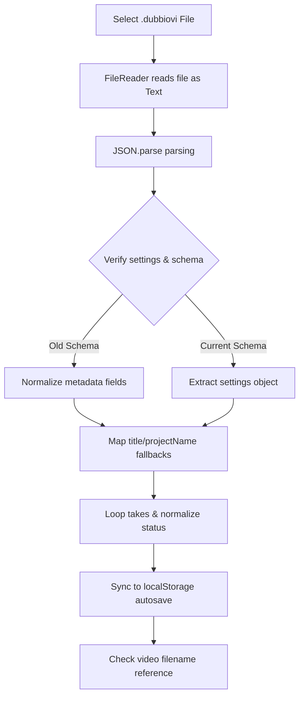

# Chapter 2: Setting Up Your Workspace & Project Management

## 2.1 Initializing a Project

### 2.1.1 The Lifecycle of Project Initialization
In DubbiOvi, a "Project" represents the complete state of a translation workspace, comprising metadata settings, a chronological table of dialogue takes, a terminology glossary, and references to media assets. Initializing a new project resets the client-side state of the application.

When a user initiates the creation of a new project (by selecting **Project -> New Project** from the top menubar), the application executes a global state reset handler. This operation is designed to wipe the active memory and restore the application to a clean default state:
*   `takes` is reset to an empty array (`[]`).
*   `glossary` is reset to an empty array (`[]`).
*   `settings` is restored to `DEFAULT_PROJECT_SETTINGS` (Project Name is set to "Untitled Project", Source Language to "EN", Target Language to "ES", and Translator to an empty string).
*   `currentIndex` (the pointer tracking the active take) is set to `0`.
*   `videoFile` and `videoUrl` are set to `null`, which unloads the video player.
*   `videoDuration` and `currentTime` are set to `0`.
*   `videoReloadHint` is set to `null`, clearing any outstanding video reload warnings.

---

### 2.1.2 Data Erasure Mechanics and Safeguards
Because DubbiOvi is built on a local-first model, project initialization has immediate consequences for data preservation.

> [!CAUTION]
> The "New Project" action is destructive and irreversible. It immediately executes `clearAutosave()`, which deletes the `dubbiovi_autosave` key from the browser's `localStorage`.

*   **Erasure Flow:** The deletion of the local storage keys removes all cached work from the browser's persistent cache.
*   **No Central Server Recovery:** Because there is no centralized database server, cloud backup, or trash bin, once the local storage key is deleted, the data is permanently lost.
*   **User Action Requirement:** To prevent accidental data loss, users must manually export their active workspace to a `.dubbiovi` project file before selecting **New Project**. The application does not auto-archive overwritten states once a new project initialization is confirmed.

---

## 2.2 Native File Operations

### 2.2.1 The .dubbiovi JSON Schema Specification
DubbiOvi packages and preserves workspaces using a custom, human-readable JSON schema saved with the extension `.dubbiovi`. This structure allows for interoperability, manual editing, and backwards compatibility.

A standard `.dubbiovi` document contains the following fields:

```json
{
  "formatVersion": "1.2",
  "createdAt": "2026-06-25T15:00:00.000Z",
  "projectName": "Sample Translation Project",
  "videoFileName": "interview_session_01.mp4",
  "settings": {
    "projectName": "Sample Translation Project",
    "sourceLang": "EN",
    "targetLang": "ES",
    "translator": "A. C. Rodríguez"
  },
  "takes": [
    {
      "id": "c71b3e94-c102-402a-84a6-e67237e442e3",
      "character": "Speaker 1",
      "time": "00:01.200 - 00:04.500",
      "startSeconds": 1.2,
      "endSeconds": 4.5,
      "original": "Welcome to the research laboratory.",
      "translation": "Bienvenidos al laboratorio de investigación.",
      "notes": "Ensure scientific tone.",
      "status": "Reviewed"
    }
  ],
  "glossary": [
    {
      "id": "g-84a6-e67237e442e3",
      "sourceTerm": "laboratory",
      "targetTerm": "laboratorio",
      "notes": "Standard noun translation."
    }
  ]
}
```

#### Fields Description:
*   `formatVersion` *(string)*: Tracks compatibility. Version 1.3.7 uses format `1.2`.
*   `createdAt` *(string)*: ISO 8601 timestamp recording when the file was created.
*   `projectName` *(string)*: The descriptive name of the project.
*   `videoFileName` *(string | null)*: The filename of the media file associated with this project. Used for video verification.
*   `settings` *(object)*: Contains nested project configuration parameters:
    *   `projectName` *(string)*: Project name metadata.
    *   `sourceLang` *(string)*: The two-letter code for the source language (e.g., "EN").
    *   `targetLang` *(string)*: The two-letter code for the target language (e.g., "ES").
    *   `translator` *(string)*: Name of the assigned translator.
*   `takes` *(array)*: A list of Take objects containing:
    *   `id` *(string)*: A unique UUID v4 identifier.
    *   `character` *(string)*: The name of the speaker.
    *   `time` *(string)*: Text representation of start and end points.
    *   `startSeconds` *(number)*: Start time of the take segment in seconds.
    *   `endSeconds` *(number)*: End time of the take segment in seconds.
    *   `original` *(string)*: The source-language dialogue text.
    *   `translation` *(string)*: The target-language translation text.
    *   `notes` *(string)*: Optional notes or annotations.
    *   `status` *(string)*: The status of the take workflow (`Pending`, `Reviewed`, or `Locked`).
*   `glossary` *(array)*: Glossary objects containing:
    *   `id` *(string)*: Unique term identifier.
    *   `sourceTerm` *(string)*: The word or phrase in the source language.
    *   `targetTerm` *(string)*: The preferred translation.
    *   `notes` *(string)*: Optional grammatical or contextual notes.

---

### 2.2.2 The File Import Parsing and Verification Pipeline
When a `.dubbiovi` file is opened via the **Project -> Open Project** menu, it passes through a parsing and validation pipeline:



1.  **Read Action:** A `FileReader` object reads the file as plain text.
2.  **Schema Check:** The text is parsed using `JSON.parse`. The parser checks for essential root keys (`settings`, `takes`, and `glossary`).
3.  **Backwards Compatibility Mapping:** If the file was generated under an older version of the software, the parser maps deprecated fields to the current schema. For example, if `projectName` is missing but `title` is defined, the parser maps `title` to `projectName`. If metadata fields are missing, they default to empty strings or "Untitled Project".
4.  **Takes & Status Normalization:** The parser processes each take object, validating that `startSeconds` and `endSeconds` are numbers and normalizes the `status` field (ensuring values are mapped strictly to `'Pending'`, `'Reviewed'`, or `'Locked'`).
5.  **Local Cache Update:** Once parsed and validated, the data is written to the active React state and immediately synchronized with `localStorage` via the `syncAutosave` utility.

---

### 2.2.3 The Video Verification System
Because web browsers restrict direct local file system access for security reasons, the application cannot automatically open or stream video files from a local hard drive path. To solve this limitation, DubbiOvi implements a **Video Verification System**:

1.  **Reference Comparison:** Upon opening a project, the parser retrieves the `videoFileName` string from the project file and compares it to the currently loaded video file name in memory (`videoFile.name`).
2.  **Reload Warning Trigger:** If the video file is missing or the filenames do not match, the application:
    *   Sets the `videoReloadHint` state to the expected filename.
    *   Displays a toast notification: `⚠️ Video File Required: Please reload video file: [filename]`.
    *   Displays a flashing amber warning banner at the top of the video player area: `⚠️ Please reload video file: [filename]`.
3.  **URL Revocation:** When the user uploads the matching video file, the system calls `URL.revokeObjectURL(videoUrl)` to release the browser memory used by the old video stream.
4.  **Blob Resolution:** The system generates a new object URL for the uploaded video, clears the `videoReloadHint` state, and removes the warning banner.

---

## 2.3 Setting Up Google Gemini AI Integration

### 2.3.1 Step-by-Step Google Gemini API Key Setup
To use DubbiOvi's AI-assisted features (automatic speech recognition transcription and translation suggestions), users must configure a personal Google Gemini API key.

```text
[Get API Key from Google AI Studio] 
            │
            ▼
[Copy Key string (AIzaSy...)] 
            │
            ▼
[Navigate to Settings tab -> AI Configuration]
            │
            ▼
[Paste Key and click 'Save API Key'] 
            │
            ▼
[Click 'Test Connection' to verify API status]
```

1.  **Obtaining the API Key:**
    *   Navigate to **Google AI Studio** (`https://aistudio.google.com`).
    *   Log in with a Google account.
    *   Click the **Get API key** button.
    *   Click **Create API key** and copy the generated alphanumeric key string (typically starting with `AIzaSy`).
2.  **Configuring the Key in DubbiOvi:**
    *   Open the DubbiOvi application and select the **Settings** tab in the right-hand panel.
    *   Scroll down to the **AI Configuration** sub-panel.
    *   Paste the copied API key string into the **Gemini API Key** field. The field is masked by default; click the **Eye** icon to view the plain text key.
    *   Click the **Save API Key** button. The status badge will change from an amber `⚠ No API Key Configured` warning to an emerald `✓ API Key Configured` checkmark.
3.  **Testing the Connection:**
    *   With the key pasted into the input field, click the **Test Connection** button.
    *   The application displays a `Testing...` loading state and sends a lightweight server-side verification request.
    *   If the key is valid, a green toast notification will confirm: `Connection Successful: Gemini API Key is valid and working.`
    *   If the key is invalid or blocked, a red toast notification will display the error returned by the API.

---

### 2.3.2 Security, Privacy, and Data Processing Framework
DubbiOvi is designed with client-side key isolation to ensure user privacy and security:

*   **Browser-Side Storage Isolation:** When you click **Save API Key**, the key is saved directly to the client browser's local storage under the key `dubbiovi_gemini_api_key`. The key is never stored on a DubbiOvi server, and there is no database repository that collects user credentials.
*   **Server Action Dynamic Forwarding:** AI requests (such as ASR transcription or translation suggestions) are processed via Next.js server actions. These actions run in a secure server-side environment to protect API keys from exposure in the client browser's network logs.
    *   When an AI feature is requested, the client retrieves the key from local storage and forwards it as a dynamic parameter (`apiKey`) within the server action request payload.
    *   The server action uses the forwarded key to authorize the request with the Google Gemini API.
    *   Once the request is completed, the server action returns the output text to the client and discards the key from its temporary execution memory.
*   **System Fallback Architecture:** If the client does not provide a key in the request payload, the server action falls back to checking for a default `GEMINI_API_KEY` environment variable configured on the host server. This allows educational institutions to host pre-configured instances of DubbiOvi for student use without requiring individual API keys.
*   **Direct API Channeling:** All AI operations communicate directly with Google's official Gemini API endpoints. No intermediate third-party servers parse, audit, or store your project data.
*   **Data Retention Policy:** Under Google's standard developer terms for API keys, data sent to the Gemini API is not used to train Google's models. This ensures that translation drafts, terminology glossaries, and audio recordings remain confidential.
